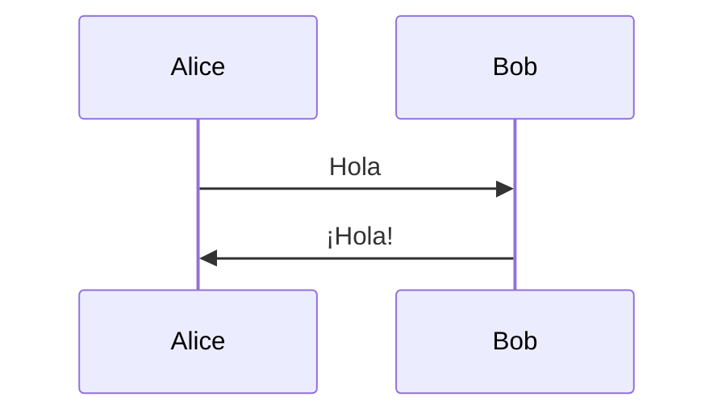

# 📝 MD TUI

Visualizador de Markdown para Termux y terminal, optimizado para uso táctil en móviles. Soporta diagramas Mermaid y D2 con zoom.


## ✨ Características

- 📁 **Explorador de archivos** integrado con navegación táctil
- 📖 **Visualizador Markdown** con formato rico
- 🧜 **Soporte Mermaid** - diagramas de secuencia, flowcharts, clases
- 🎨 **Soporte D2** - diagramas modernos de infraestructura
- 🔍 **Zoom** en diagramas (25% - 300%)
- 📱 **Optimizado para Termux** - botones grandes, navegación touch-friendly
- ⌨️ **Atajos de teclado** - para uso en desktop también

## 🚀 Instalación Rápida

### Termux (Android)

```bash
# Clonar o descargar el proyecto
cd ~
git clone <url-del-repo> mdtui
cd mdtui

# Instalar
bash install.sh
```

### Linux/macOS

```bash
# Requisitos
pip install textual rich markdown

# Ejecutar directamente
python3 mdtui.py
```

## 📖 Uso

```bash
# Abrir explorador en directorio actual
mdtui

# Abrir archivo específico
mdtui documento.md

# Abrir directorio específico
mdtui ~/Documentos
```

## 🎮 Controles

### Táctil (Termux)
- **Tocar** - Seleccionar archivo/carpeta
- **Doble toque / Enter** - Abrir
- **Botones inferiores** - Navegación
- **Deslizar** - Scroll

### Teclado
| Tecla | Acción |
|-------|--------|
| `↑/↓` | Navegar |
| `Enter` | Abrir selección |
| `Backspace` | Subir directorio |
| `v` | Ver diagrama (en visor MD) |
| `+/-` | Zoom en diagramas |
| `h` o `?` | Ayuda |
| `q` | Salir |

## 📊 Diagramas

### Mermaid
Los diagramas Mermaid se detectan automáticamente:

```markdown

```

Para visualizar: presiona `v` cuando veas el placeholder.

### D2
Igualmente soportado:

```markdown
```d2
direction: right
A -> B: Conexión
```
```

### Instalar renderizadores (opcional)

Para una mejor experiencia, instala las herramientas CLI:

```bash
# Mermaid (requiere Node.js)
npm install -g @mermaid-js/mermaid-cli

# D2 (requiere Go)
go install oss.terrastruct.com/d2@latest
```

Sin estas herramientas, los diagramas se muestran en modo ASCII simplificado.

## 🛠️ Desarrollo

```bash
# Clonar repo
git clone <url>
cd mdtui

# Crear entorno virtual
python3 -m venv venv
source venv/bin/activate

# Instalar dependencias
pip install -r requirements.txt

# Ejecutar en modo desarrollo
python3 mdtui.py --dev
```

## 📁 Estructura

```
mdtui/
├── mdtui.py              # Aplicación principal
├── mdtui_diagrams.py     # Módulo de renderizado de diagramas
├── mdtui.css             # Estilos Textual
├── requirements.txt      # Dependencias
├── install.sh            # Script de instalación
└── README.md             # Este archivo
```

## 🔧 Requisitos

- Python 3.8+
- textual >= 0.52.0
- rich >= 13.0.0

### Opcional para diagramas
- Node.js + npm (para Mermaid)
- Go (para D2)

## 📝 TODO

- [ ] Soporte para editar archivos
- [ ] Búsqueda en archivos
- [ ] Favoritos/bookmarks
- [ ] Vista previa de imágenes
- [ ] Soporte para tabs múltiples
- [ ] Exportar a PDF/HTML

## 🤝 Contribuir

Pull requests bienvenidos. Para cambios mayores, abre un issue primero.

## 📜 Licencia

MIT License - ver LICENSE para detalles.

---

Hecho con ❤️ para la comunidad Termux
