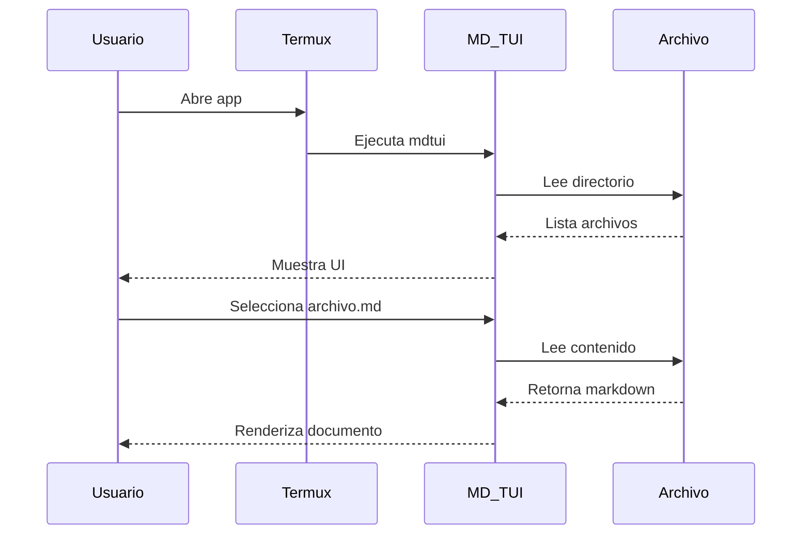
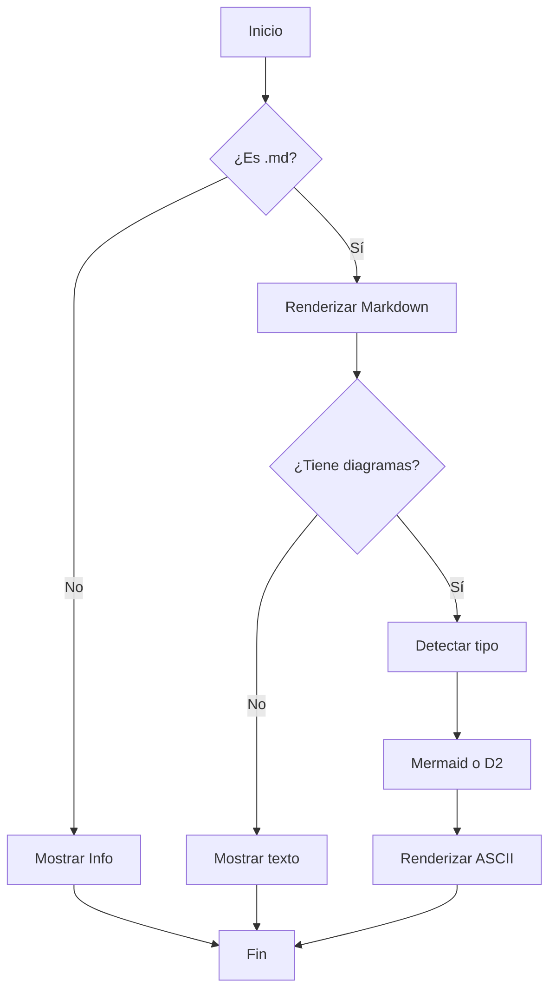
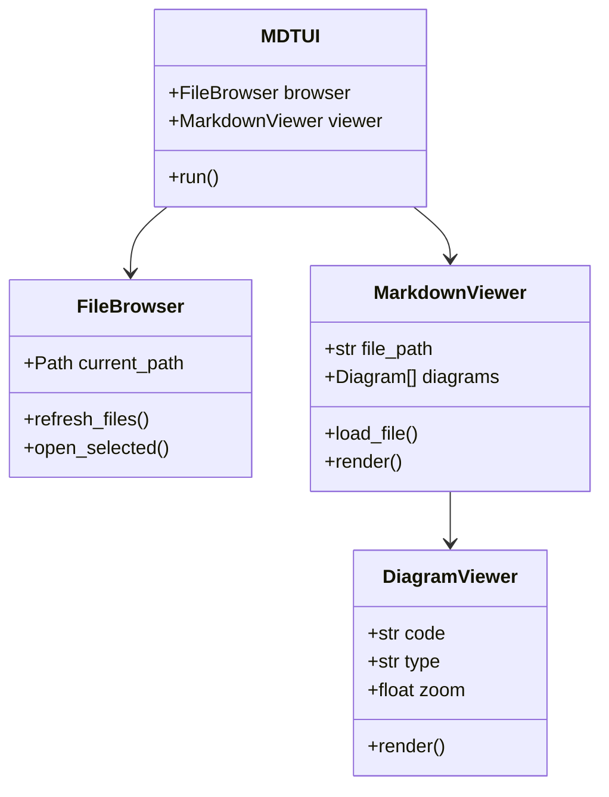

# 📝 Ejemplo de Markdown con Diagramas

Este archivo demuestra las capacidades de **MD TUI**.

## Diagrama de Secuencia (Mermaid)



## Flowchart (Mermaid)



## Diagrama D2

```d2
direction: right

App: MD TUI {
  shape: rectangle
  style.fill: "#4a90d9"
}

User: Usuario {
  shape: person
}

Files: Sistema de Archivos {
  shape: cylinder
}

Diagrams: Renderizador {
  Mermaid: 🧜 Mermaid
  D2: 🎨 D2
}

User -> App: Interactúa
App -> Files: Lee archivos
App -> Diagrams: Renderiza diagramas
```

## Diagrama de Clases



## Características de Texto

### Listas
- ✅ Explorador de archivos integrado
- ✅ Soporte Mermaid y D2
- ✅ Zoom en diagramas
- ✅ Optimizado para móvil

### Tablas
| Característica | Mermaid | D2 |
|---------------|---------|-----|
| Secuencias | ✅ | ✅ |
| Flowcharts | ✅ | ✅ |
| Clases | ✅ | ❌ |
| Infraestructura | ❌ | ✅ |

### Código

```python
# Ejemplo de código Python
def hello_termux():
    print("¡Hola desde MD TUI!")
    return "📝"

hello_termux()
```

---

**Presiona `v` para ver cualquier diagrama en modo detalle con zoom!**
